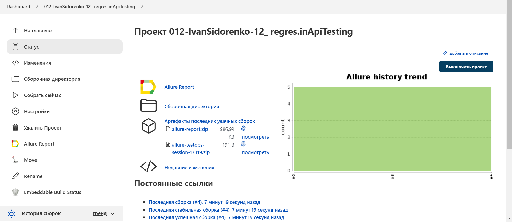
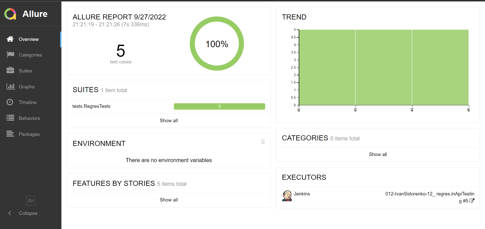
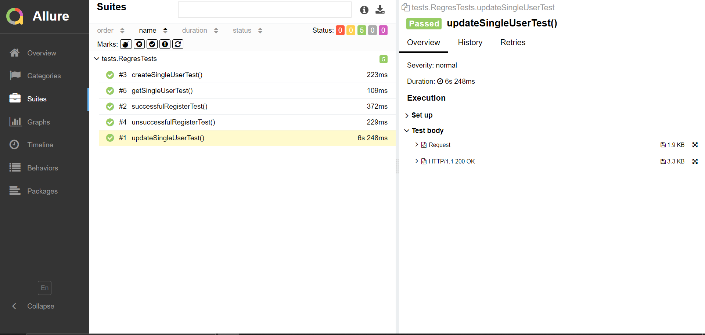
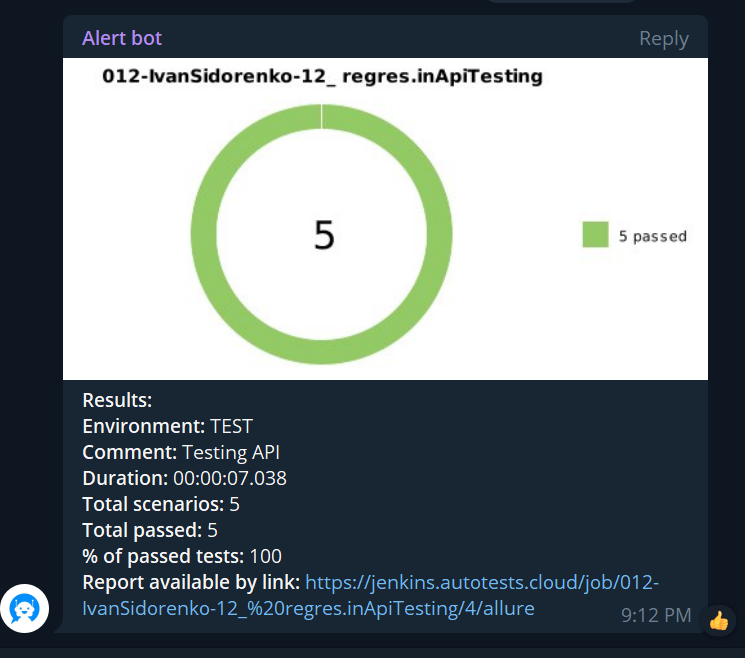

# Автотесты мобильного приложения Wikipedia
# :page_with_curl: Содержание:

- [Технологии и инструменты](#techno-технологии-и-инструменты)
- [Запуск автотестов](#arrow_forward-запуск-из-терминала)
- [Сборка в Jenkins](#jenkins-Jenkins-job)
- [Allure отчет](#report-Allure-отчет)
- [Пример выполнения теста](#telegram-Уведомление-в-Telegram-при-помощи-бота)

<a name="techno-технологии-и-инструменты"></a>
## :computer: Технологии и инструменты

<p align="center">


</p>

<a name="arrow_forward-запуск-из-терминала"></a>
## :keyboard: Запуск автотестов

Локальный запуск:
```
gradle clean android -DdeviceHost=local 
```

Удаленный запуск:
```
gradle clean android -DdeviceHost=browserstack
```

<a name="jenkins-Jenkins-job"></a>
## :robot: Сборка в Jenkins
### <a target="_blank" href="https://jenkins.autotests.cloud/job/012-IvanSidorenko-12_%20regres.inApiTesting/">Параметризированная сборка в Jenkins со всеми тестами</a>
<p align="center">

</p>

<a name="report-Allure-отчет"></a>
## :bar_chart: Allure отчет
- ### Главный экран отчета
<p align="center">

</p>

- ### Страница с проведенными тестами
<p align="center">

</p>

<a name="telegram-Уведомление-в-Telegram-при-помощи-бота"></a>
## :robot: Пример выполнения теста
<p align="center">
  
</p>

